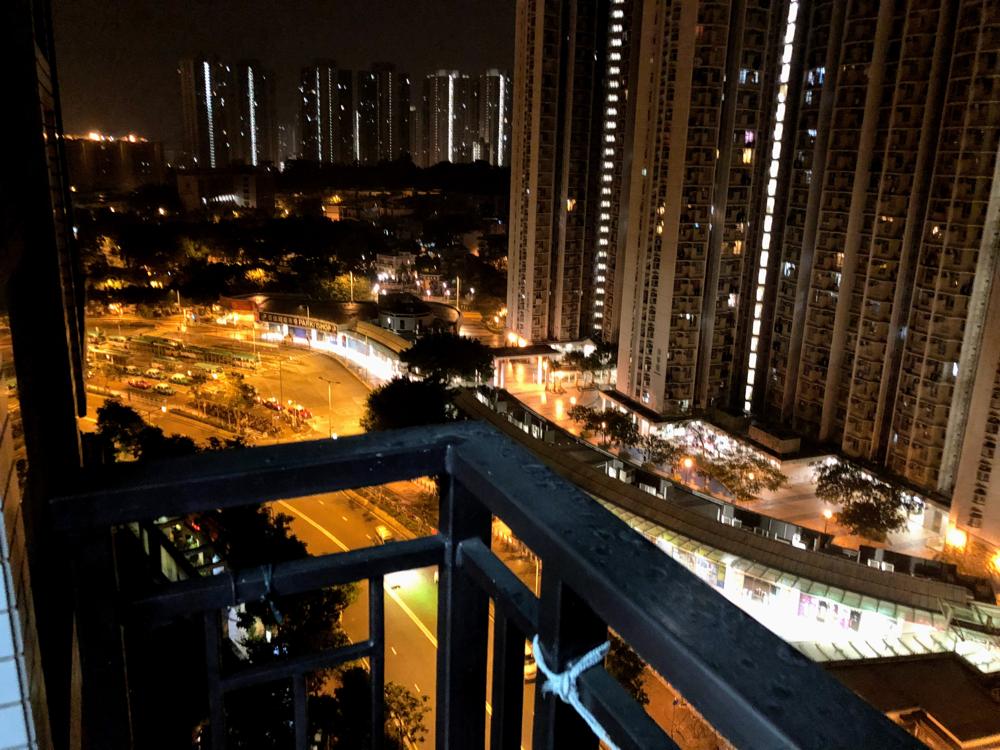
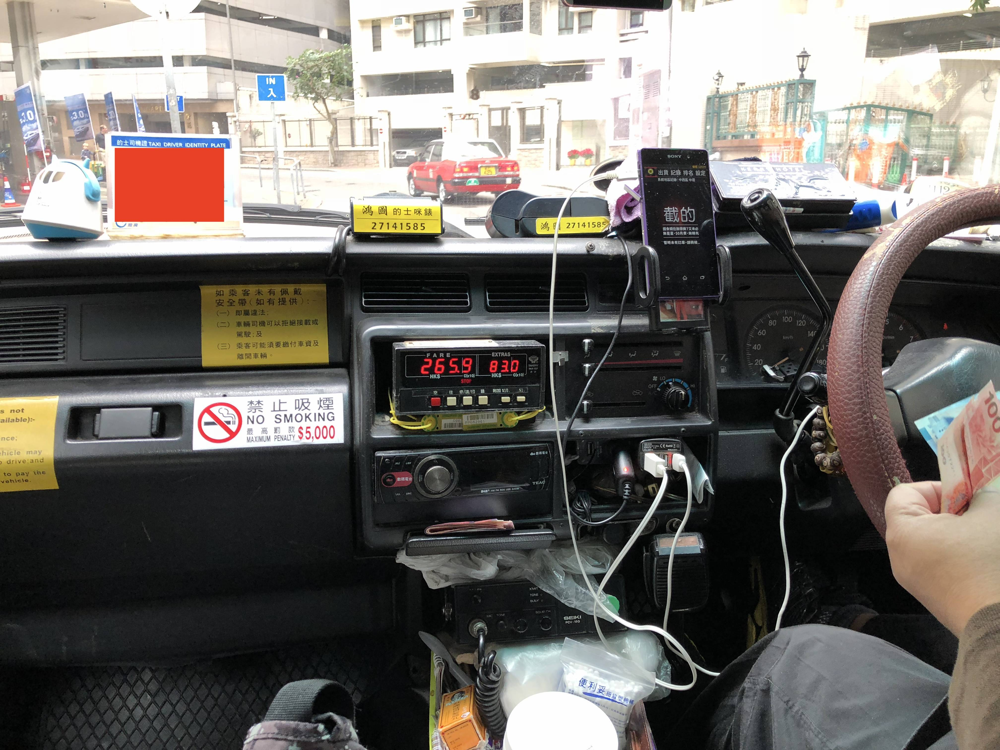
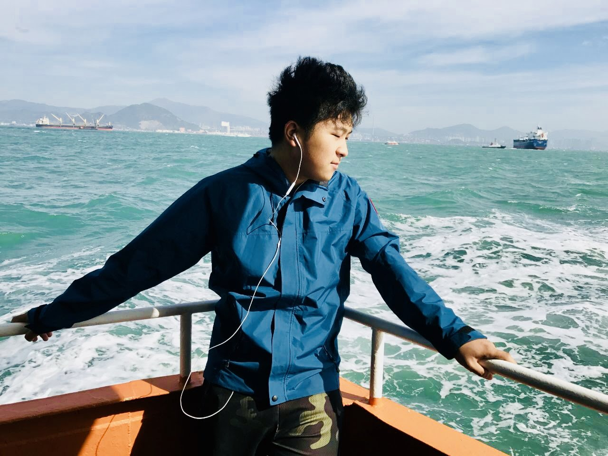
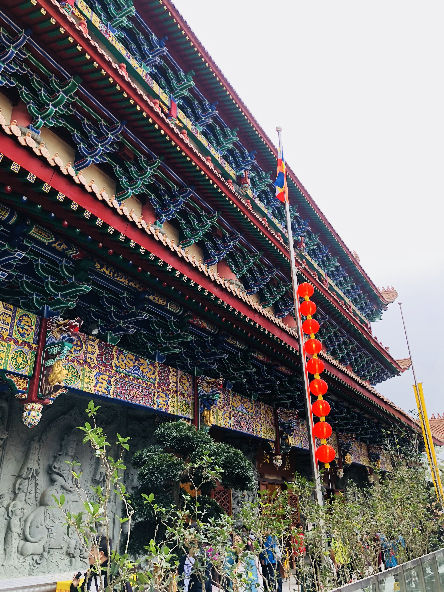
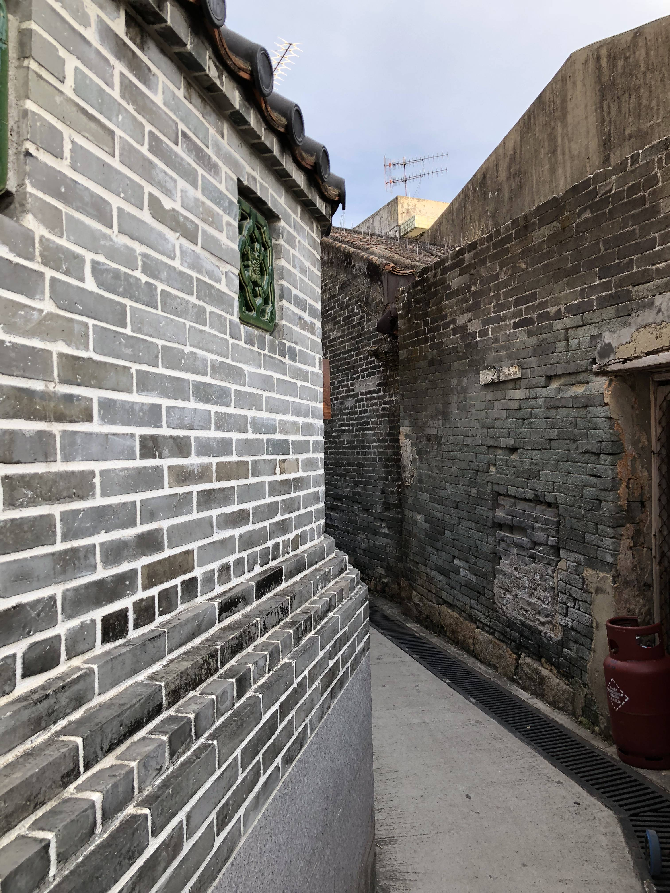
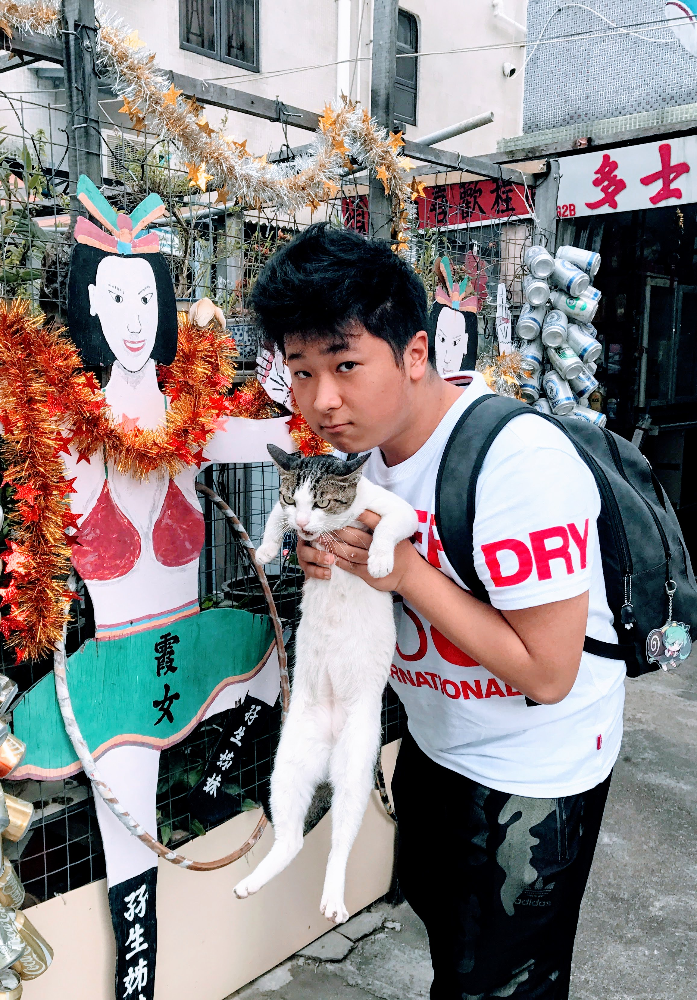
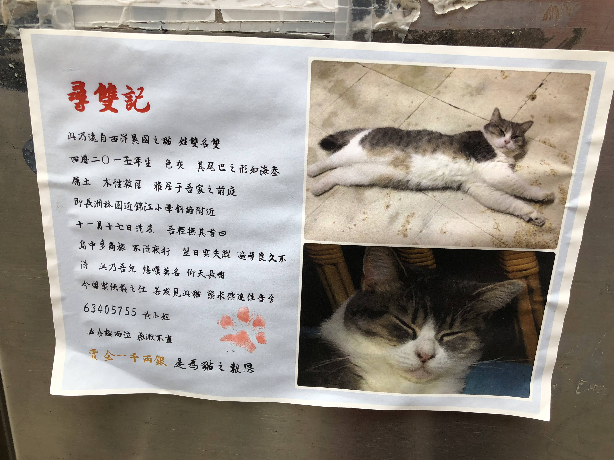
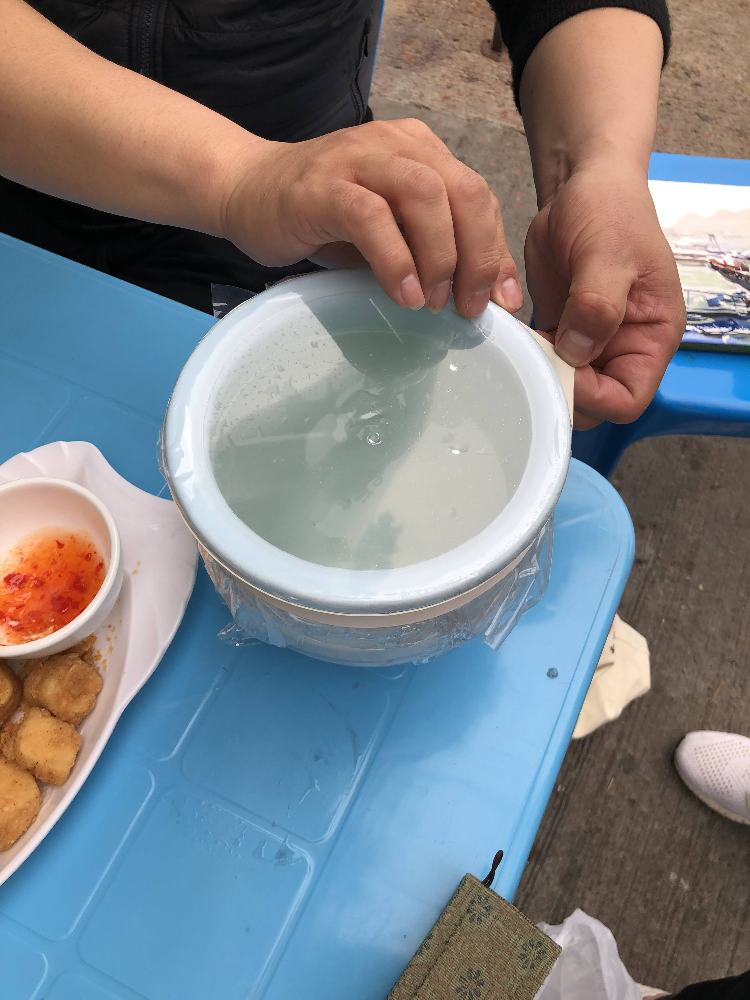
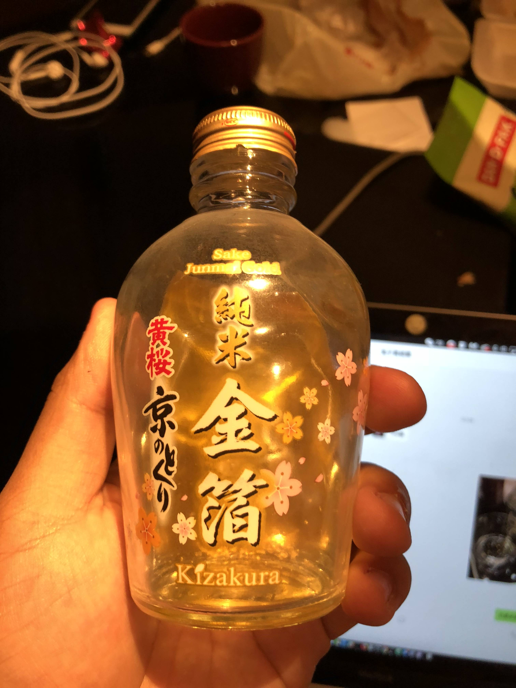
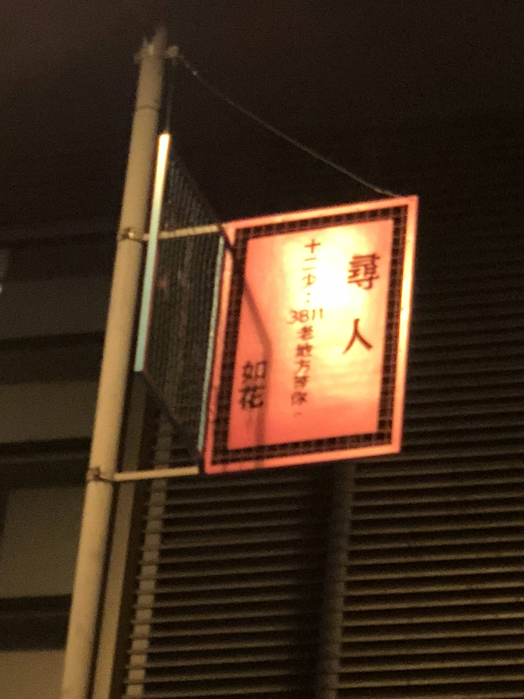

家中母上決定每年跨年都在不同的地方。今年就近去了香港，正逢 iPhone X 上市，先來兩台。

跨完年又散心，維港的煙花反而沒有那麼誘人，本來想直接回深圳睡覺，口岸已經關了，但是又懶得去皇崗口岸，所以就在上水住下。

第二天清醒了之後，母上回深圳了，我有幸和張闖老師一同去采風寫生。得知張闖老師也在香港後，直接選擇了最快的速度趕過去，掐指一算，應該是人生中打過最貴的一次的士，從新界橫穿香港到尖沙咀。中間橫穿過道，有點肉疼。

由於手頭港幣不夠了，只能按照行規 1:1 付人民幣給司機，我一直覺得香港的的士車有點賽博朋克的初階味道，一般會掛兩到三台手機聽單，還有司機聊天頻道供司機解悶。司機掛著耳麥，電線飛纏，頗有一番感覺。

碼頭上傳，船程一個小時，海上風比較大。

長洲島，海陆丰文化帶來的廟，宮，島上的貓是此行的主要目的。

> 长洲在乾隆年间得到很大的发展，现时岛上的主要庙宇，例如[北社天后古庙](https://zh.wikipedia.org/wiki/%E5%8C%97%E7%A4%BE%E5%A4%A9%E5%90%8E%E5%8F%A4%E5%BB%9F "北社天后古庙")（乾隆三十二年，1767年）、[大石口天后古庙](https://zh.wikipedia.org/w/index.php?title=%E5%A4%A7%E7%9F%B3%E5%8F%A3%E5%A4%A9%E5%90%8E%E5%8F%A4%E5%BB%9F&action=edit&redlink=1 "大石口天后古庙（页面不存在）")（乾隆三十七年，1772年）、[西湾天后宫](https://zh.wikipedia.org/w/index.php?title=%E8%A5%BF%E7%81%A3%E5%A4%A9%E5%90%8E%E5%AE%AE&action=edit&redlink=1 "西湾天后宫（页面不存在）")（乾隆三十九年，1774年）及[长洲玉虚宫](https://zh.wikipedia.org/wiki/%E9%95%B7%E6%B4%B2%E7%8E%89%E8%99%9B%E5%AE%AE "长洲玉虚宫")（乾隆四十八年，1783年）都是在那个时期兴建。

「尋雙記」是讓我印象十分深刻的尋貓啟示，讓我不得不佩服「文化底蘊」所帶來的不僅僅是那些我們還沒有做到的禮節，還有更多......

> 此乃遠自西洋異國之貓 姓雙名雙
>
> 西曆二零一五年生 色灰 其尾巴之形如海參
>
> 屬土 本性敦厚 雅居與吾家之前庭
>
> 即長洲林園近錦江小學斜路附近
>
> 十一月十七日清晨 吾輕撫其首曰
>
> 島中多商旅 不得夜行 翌日突失蹤 邊尋良久不得 此乃吾兒 悲嘆莫名 仰天長嘯
>
> 今望眾俠義之仕 若發見此貓 懇求傳達佳音至
>
> 必喜極而泣 感激不盡
>
> 賞金一千兩銀 是為貓之報恩

島上買的日本清酒，整整一罈酒。金箔酒就很普通，喝了兩天都沒有喝完。

> 有人說：香港之亂，是冷暖不知命運。而善有善報、惡有惡報。也只不過是地球運轉的規則。 諷刺的是，卻是這座俗透了的城市教會我善良。
